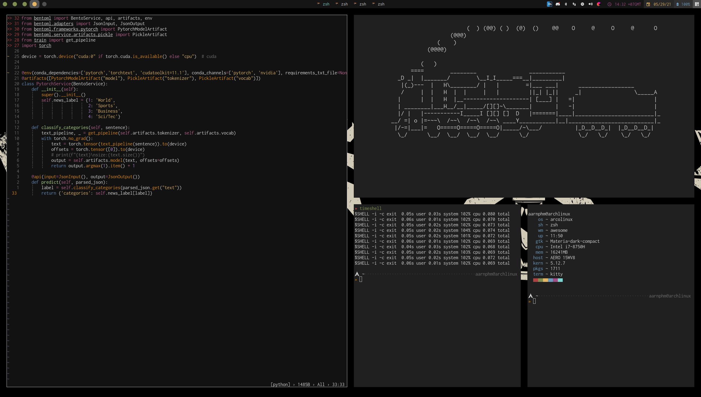

<h1 align="center">aaron does dotfiles</h1>

<div align="center"><p>automated deployment for <code>!~</code> across Unix-based system.</p></div>



- managed with [chezmoi](https://www.chezmoi.io/) 
- secrets stored with [BitWarden CLI](https://bitwarden.com/) and [Unix pass](https://www.passwordstore.org/)
- I have included a Docker version of my dotfiles if you want to try it out.

# Installation

```sh 
    $ curl -fsSL https://raw.githubusercontent.com/aarnphm/dotfiles/HEAD/install | bash
```
- for first time installer do `make build`
- checkout [bootstrap README](bootstrap/README.md) for more information
- the scripts will install a baseline, if you want a more rich experience take a look at [Pacfile.local](Pacfile.local) and [Aurfile.local](Aurfile.local) and run `make full-install`
A more responsible options:
- after installing chezmoi you can do `chezmoi init git@github.com:aarnphm/dotfiles.git`
- `chezmoi diff -v` to see different files, `chezmoi apply -v --dry-run` to check for errors
- then run `chezmoi apply -v` to see the magic happens
- Runtime goes zoooom

