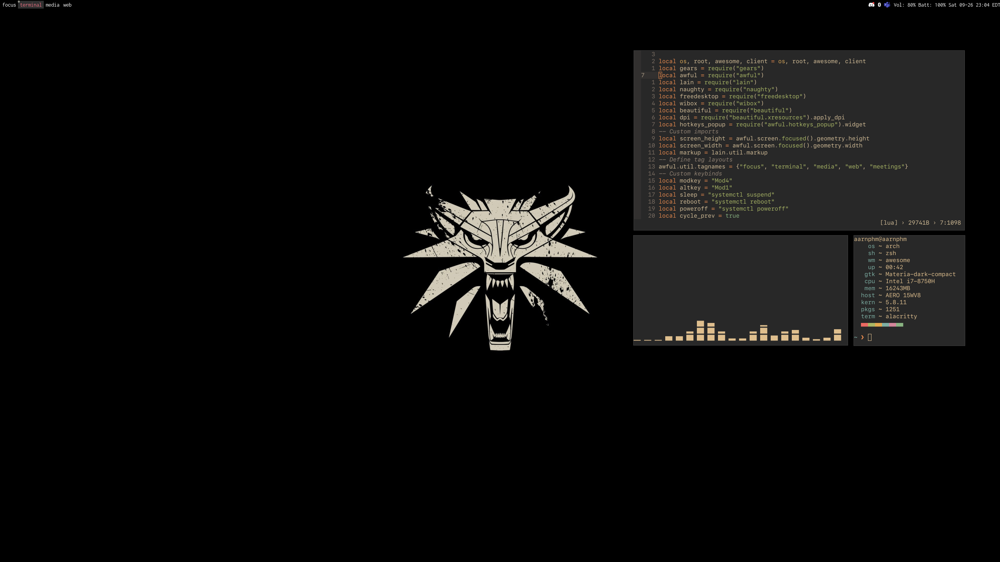

    <h1>.dotfiles</h1>
    
There's no place like <b><code>~</code></b> !

    

    
    
    
    
    
    
    
      
    
      
    

just a tiny collection of my development environment, built for _Arch_ and _MacOS_

- I have included a Docker version of my dotfiles if you want to try it out.
- Make sure you have `docker` installed. then do `make build` the followed by `make run`
- now if you save all ur folder inside `pkg` u can run `make stow` if you want to stow everything
- included custom built mozilla under `etc`, follow [this](https://github.com/mut-ex/minimal-forfunctional-fox) for instalation

# folder
- `stow` is used for symlink manager
- `init`: contains scripts to run for first time setup. do `make install`
    - inside `init/init.sh` contains some of `curl` commands to setup [alacritty](https://github.com/alacritty/alacritty).
- `pkg` contains all necessary folders. enjoy !

- `screenlayout`holds config for monitor setup generated from `arandr`. remember to put it in `$PATH` for `lightdm` setup

